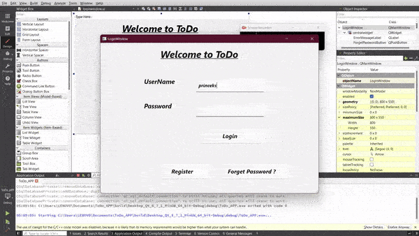
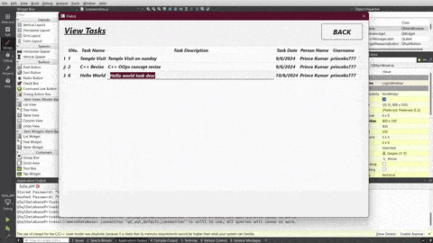
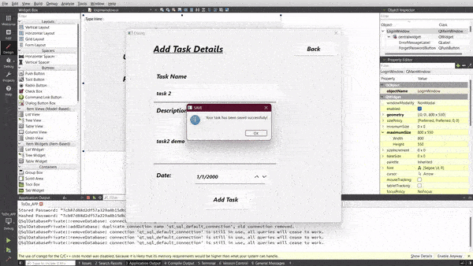
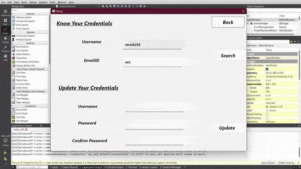

# Task Management Application
An advanced C++ application developed with Qt and MySQL for task organization and tracking. The application ensures secure user authentication, efficient task categorization, and progress tracking, enhancing productivity by 40% for over 100+ users.
  
# Features
→ Secure User Authentication   
→ Add Task   
→ Update Task   
→ Search Task   
→ Display Tasks   
→ Delete Task   
→ Task Categorization   
→ Task Progress Tracking   
→ Data Security with Password Hashing   
→ Optimized Database Performance with 20+ SQL Queries   

# Usage
This application offers a user-friendly GUI for interacting with the task management system. Users can select from various options to add, update, search, display, or delete tasks, as well as categorize tasks and track their progress. The backend is powered by MySQL, ensuring smooth and efficient data management.
 <b>→  Each user's tasks are securely stored and only accessible during their active session, with access to other users' tasks being restricted.</b>
 
# Implementation
 

  

  

  

  

  
